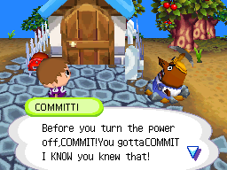

Resetti from Animal Crossing, but he blames you for committing too many files, i.e. not having committed earlier. 



##### Single Line Install
```bash
curl -fsSL https://raw.githubusercontent.com/brtmax/git-committi/refs/heads/master/install.sh | bash
```


##### To Dos
- [ ] Markov style insult engine
- [ ] Animated typing
- [ ] Add spring special options! yay
- [ ] (Mr.Resetti burrows into the ground)

##### Credits
Mr. Resetti (his full name is actually Sonny Resetti) is a fictional character from the Animal Crossing video games. He scolds you for shutting off your device without saving. Nintendo please don't take this down. 
https://animalcrossing.fandom.com/wiki/Guide:Resetti_dialogues_(Animal_Crossing)
Noriko Ikegawa, Yoshihisa Morimoto


Also, yes `git reset` could be used as well, but I'd argue that forgetting to commit is semantically closer to the message Resetti was trying to teach us.
